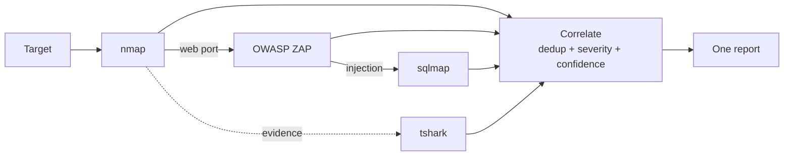

# ScanMesh


A rule-based security-tool orchestrator. It chains free, industry-standard
scanners — **nmap → OWASP ZAP → sqlmap → tshark** — into one pipeline that
discovers hosts, scans web apps, confirms injection, captures evidence, then
correlates every tool's output into a single de-duplicated report.

**100% deterministic. No AI/LLM anywhere in the pipeline.** Every decision is a
plain `if`/lookup rule.



> **Screenshots:** run the UI (below) and drop `dashboard.png` / `report.png`
> into `docs/img/` — they'll render here. Architecture detail:
> [docs/architecture.md](docs/architecture.md).

## Authorized use only

This tool is for authorized security testing only — infrastructure you own,
owned lab environments, or engagements with explicit written permission. It
does not scan or exploit on its own; it orchestrates and correlates output from
user-operated tools that you have already configured and are authorized to run.
It **suggests** next steps (e.g. "run sqlmap here") — the operator pulls the
trigger.

## Quick start

```bash
python scanmesh.py --demo        # offline self-check, needs no external tools
python scanmesh.py 127.0.0.1     # live nmap scan -> report.html
```

`--demo` runs a full offline self-check of every parser and rule, so a fresh
clone verifies with zero external tools installed.

## Full demo (web UI, all four tools)

On a machine with nmap, sqlmap, OWASP ZAP and Wireshark installed (see
[SETUP.md](SETUP.md)):

```bat
demo.cmd
```

This starts ZAP, a local **deliberately vulnerable** target
(`demo_target.py`, localhost only), and the web dashboard, then opens
`http://127.0.0.1:8000`. In the UI choose **Web scan** and enter
`http://127.0.0.1:8099/products?cat=1`. One scan exercises the whole pipeline:

- **nmap** discovers open ports
- **ZAP** crawls + active-scans the web app
- **sqlmap** confirms the SQL injection ZAP flags -> merged into one
  `critical` finding contributed by both tools
- **tshark** captures loopback traffic as evidence

Manual equivalent (four terminals): `zap-daemon`, `python demo_target.py`,
`python web.py`, then browse to the UI.

## Tools

| Stage | Tool | Cost | Install |
|---|---|---|---|
| Host/port discovery | nmap | free | https://nmap.org |
| Web app scanner | OWASP ZAP | free | `zap.sh -daemon -config api.key=<key>` |
| SQLi confirmation | sqlmap | free | `pip install sqlmap` |
| Evidence capture | tshark | free | install Wireshark, add to PATH |
| Acunetix / Burp | *optional* | paid | connectors included but marked `UNTESTED` |

ZAP is the free drop-in for the web-scanner role — it replaces the paid
Acunetix/Burp scanners (Burp's scanner + REST API are Pro/Enterprise only on
every OS; Acunetix has no free tier). The Acunetix/Burp connectors are left in
place, clearly marked, for licensed engagements.

Only `requests` is needed, and only for the REST connectors (ZAP/Acunetix/Burp)
at run time — it is imported lazily, so the module and `--demo` work without it.

```bash
pip install -r requirements.txt
```

## Lab targets

Never point this at anything you don't own or have written authorization for.
Safe practice targets: DVWA, OWASP Juice Shop, Metasploitable2 — run them inside
an isolated VM/VLAN with no internet exposure.

## How it works

Every connector normalizes to one `Finding` schema. `correlate()` merges
findings on the same **endpoint** (host + path) belonging to the same **vuln
family** — so ZAP's `SQL Injection - SQLite` and sqlmap's `SQL Injection` on the
same URL collapse into one `critical` finding contributed by both tools (more
tools agreeing = higher confidence). The rule engine advises the next tool to
run based on prior results (web port open → ZAP; ZAP finds SQLi → sqlmap). One
report comes out — in the web dashboard or as HTML.

See [docs/architecture.md](docs/architecture.md) for the full design.

## Testing

```bash
pytest                    # unit tests: parsers, correlation, web helpers
python scanmesh.py --demo # offline self-check of every parser + rule
python web.py --check     # web helper self-check
```

All three run with no external tools installed and are gated in CI on every
push. The live connectors are verified end-to-end against the local demo target.

## License

MIT — see [LICENSE](LICENSE).
