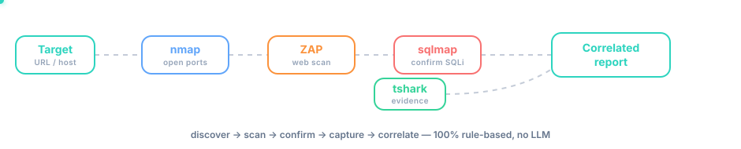
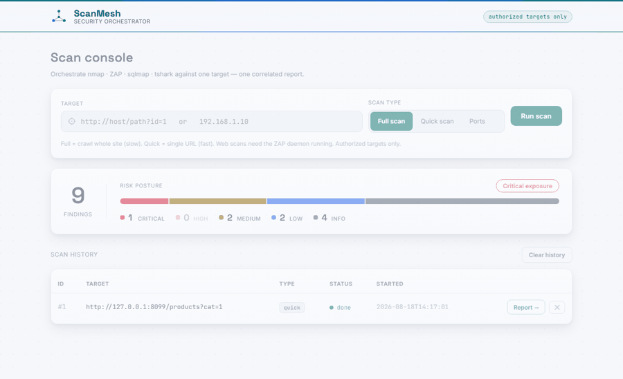
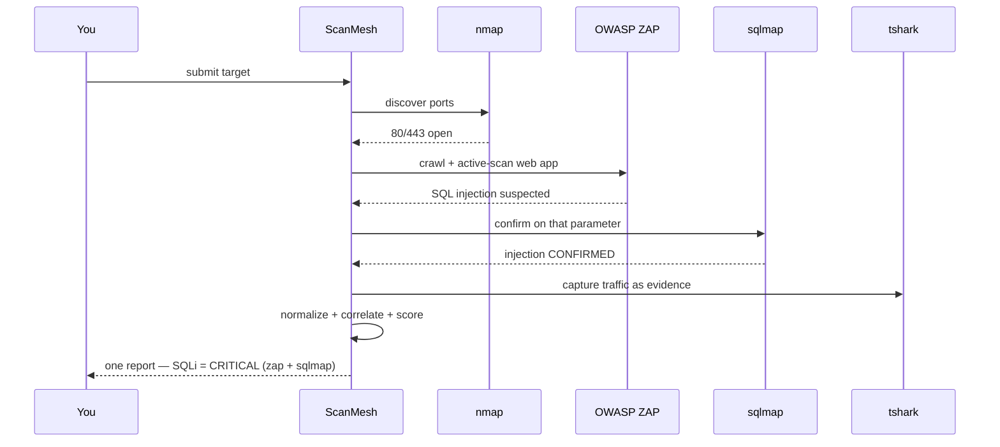
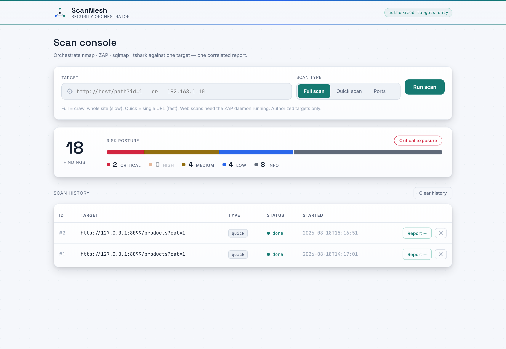
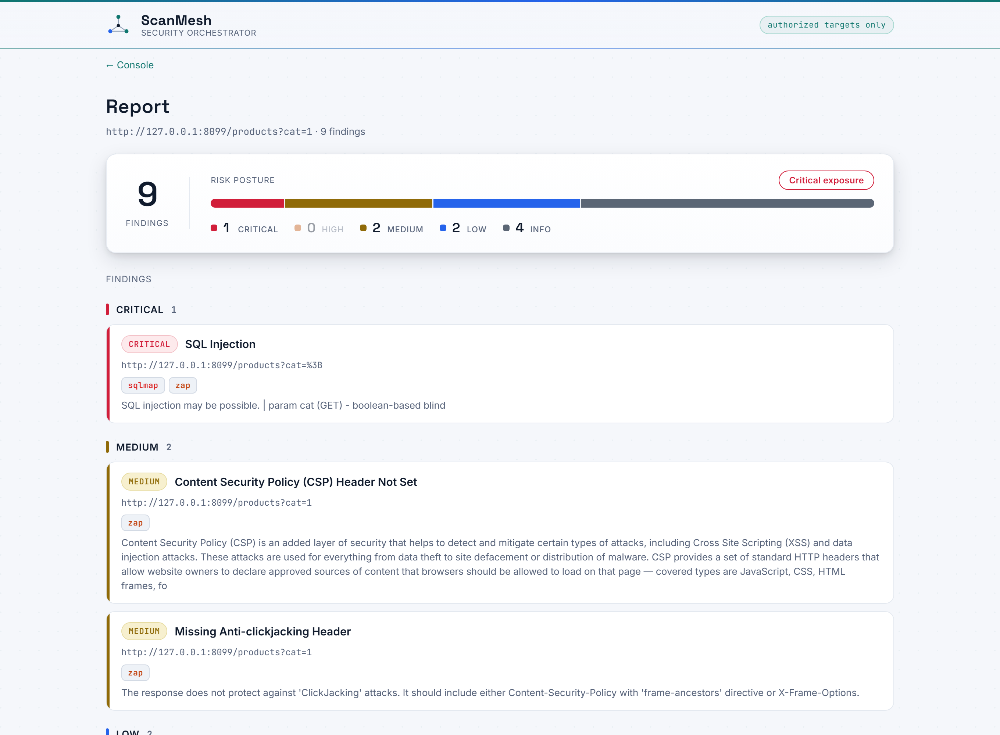

<div align="center">

# 🛰️ ScanMesh

**A rule-based security-tool orchestrator — five scanners, one correlated report.**




</div>

---

## The problem

A penetration tester runs each tool by hand — `nmap`, then a web scanner, then
`sqlmap`, then a packet capture — copies output between them, and manually
writes up five separate tool dumps into one report. It's slow, repetitive, and
easy to miss that **two tools found the same thing.**

## The solution

ScanMesh **chains the tools into one automated pipeline** and **correlates**
their output. You give it one target; it runs the right tools in the right
order and produces a **single, de-duplicated, confidence-scored report.**

The headline: when two tools independently find the same vulnerability
(ZAP *suspects* a SQL injection, sqlmap *confirms* it), ScanMesh **merges them
into one `critical` finding** — many tools agreeing = one high-confidence
result, not two vague duplicates.

> **100% deterministic. No AI/LLM anywhere.** Every decision — which tool runs
> next, what merges with what — is a plain `if`/lookup rule you can read and audit.

## Demo



> Submit a target → nmap, ZAP, sqlmap and tshark run → one correlated report.
> The SQL injection is found by ZAP, confirmed by sqlmap, and merged into a
> single **critical** finding contributed by both tools.

---

## What a scan does



## Example output

A single scan of the built-in vulnerable target produces:

| Severity | Finding | Tools |
|---|---|---|
| 🔴 **critical** | SQL Injection | `sqlmap` + `zap` |
| 🟠 medium | Content Security Policy (CSP) Header Not Set | `zap` |
| 🟠 medium | Missing Anti-clickjacking Header | `zap` |
| 🔵 low | Server Leaks Version Information | `zap` |
| 🔵 low | X-Content-Type-Options Header Missing | `zap` |
| ⚪ info | Open Port: msrpc / microsoft-ds / http-alt | `nmap` |
| ⚪ info | Traffic Evidence | `tshark` |

The `critical` row is the whole point: **ZAP found it, sqlmap confirmed it, so
it correlates into one high-confidence finding contributed by both tools.**

## Features

- **Five connectors** — nmap · OWASP ZAP · sqlmap · tshark (+ optional Acunetix/Burp)
- **Correlation engine** — de-dup by endpoint + vuln family, keep max severity, union tools
- **Rule engine** — deterministic "run this next" (web port → ZAP; SQLi → sqlmap)
- **Risk posture** — every report states a verdict: *Critical exposure → Informational*
- **Web dashboard** — submit a scan, live status, grouped report (stdlib only, no framework)
- **Persistence** — SQLite scan history
- **Free-tool core** — nothing paid required; ZAP replaces commercial web scanners
- **Tested** — unit tests + CI on every push; parsers verified offline

---

## Quick start

Install Python 3.11+ and the tools (see [SETUP.md](SETUP.md)), then:

```bat
demo.cmd
```

This launches ZAP, a **local deliberately-vulnerable target**, and the web
dashboard, then opens `http://127.0.0.1:8000`. Choose **Web scan**, enter
`http://127.0.0.1:8099/products?cat=1`, and watch all four tools run.

Or from the terminal:

```bash
python scanmesh.py 127.0.0.1     # nmap scan -> report.html
python scanmesh.py --demo        # offline self-check, no tools needed
```

## Screenshots

| Scan console | Correlated report |
|---|---|
|  |  |

---

## How it works

Every connector normalizes to one `Finding` schema. `correlate()` merges
findings on the same **endpoint** (host + path) in the same **vuln family** —
so ZAP's `SQL Injection - SQLite` and sqlmap's `SQL Injection` on the same URL
collapse into one `critical` finding contributed by both tools. The rule engine
picks the next tool from prior results. One report comes out — dashboard or HTML.

Full design, diagrams and trade-offs: **[docs/architecture.md](docs/architecture.md)**.

## Testing

```bash
pytest                    # unit tests: parsers, correlation, web helpers
python scanmesh.py --demo # offline self-check of every parser + rule
python web.py --check     # web-helper self-check
```

All run with **no external tools installed** and are gated in CI on every push.

## Scope & authorized use

For authorized testing only — infrastructure you **own**, owned lab
environments, or engagements with **explicit written permission**. ScanMesh
orchestrates user-operated tools and *suggests* next steps; the operator pulls
the trigger. Safe practice targets: the bundled demo target, DVWA, OWASP Juice
Shop, Metasploitable2 — inside an isolated VM/VLAN.

## Roadmap / known limits

- Scans run one at a time — a lock serializes them, since a single ZAP daemon can't run concurrent active scans cleanly *(add per-scan ZAP sessions for parallelism)*
- SQLite → single host *(Postgres when multi-user)*
- Acunetix/Burp connectors written but **untested** — commercial licenses; parsers pass on sample data, treated as planned enterprise integrations
- No Docker — tshark's Npcap driver doesn't containerize on Windows (deliberate non-goal)

## License

MIT — see [LICENSE](LICENSE). Built by **Muhammad Waseem**.
