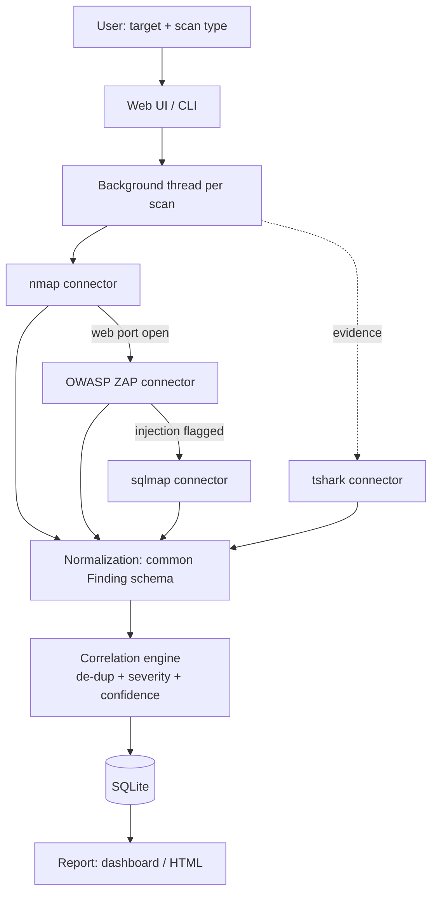

# ScanMesh — Architecture

100% deterministic, rule-based orchestration. No AI/LLM anywhere in the pipeline.

## Pipeline

## Components

| Layer | File | Responsibility |
|---|---|---|
| Connectors | `scanmesh.py` | Run each tool (subprocess/REST) + a pure parser per tool |
| Normalization | `scanmesh.py` (`Finding`, `norm_sev`) | Every tool's output → one schema, CVSS-aligned severity |
| Rule engine | `scanmesh.py` (`next_steps`) | Deterministic "what to run next" (web port → ZAP; injection → sqlmap) |
| Correlation | `scanmesh.py` (`correlate`) | Merge same vuln-family on same endpoint; keep max severity; union tools |
| Persistence | `web.py` (SQLite) | `scans` (job history) + `findings` (correlated results) |
| Web UI | `web.py` (stdlib `http.server`) | Submit scan, live status poll, view report |
| Report | `web.py` (`report_page`) / `scanmesh.py` (`render_report`) | Findings grouped by severity + risk posture |

## Key design decisions

- **Connector = runner + pure parser.** The parser is pure and unit-tested; the
  runner just shells out or hits a REST API. This is why parsers are verified in
  CI even though the tools themselves aren't installed there.
- **Correlation by (endpoint, vuln-family).** `ZAP "SQL Injection - SQLite"` and
  `sqlmap "SQL Injection"` on the same path collapse into one `critical` finding
  contributed by both tools — two tools agreeing = higher confidence.
- **sqlmap is targeted.** It only confirms injection points another tool flags (or
  the submitted URL's own params) — never a blind sweep. Keeps scope tight.
- **Stdlib over frameworks.** `http.server` + threads + SQLite instead of
  FastAPI/Celery/Redis/Postgres — a single-operator tool doesn't need a
  distributed system. Those are the documented upgrade path, not the MVP.

## Deliberate limitations (upgrade path)

- One ZAP daemon → concurrent scans serialize. Add per-scan ZAP sessions or a job
  queue only if throughput matters.
- SQLite → single host. Postgres when multiple writers/users appear.
- Acunetix/Burp connectors are written but **untested** (commercial licenses).
  Parsers pass on sample data; treat as planned enterprise integrations.
